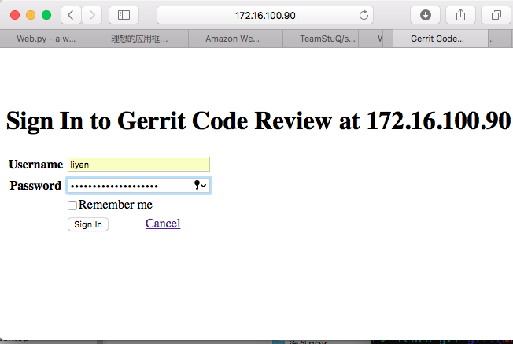
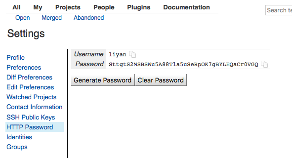
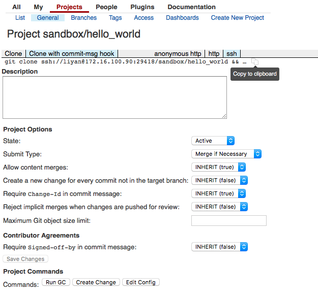
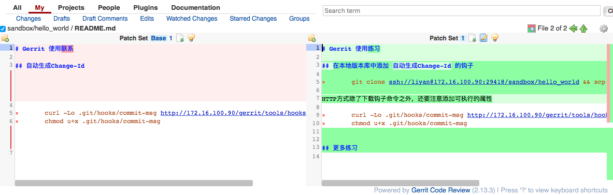

# Gerrit 起步

## 登录 Web 控制台
[Gerrit Web Console](http://172.16.100.90/gerrit/) 已经集成了大家的jira账号，可以直接登录(Sign In)

## 配置 SSH(HTTP) 访问认证 

进入[Settings](http://172.16.100.90/gerrit/#/settings/)界面

### SSH Public Keys

点"Add Key ..."按钮，把本机ssh密钥对中的公钥填入对话框。 

☞ 进一步阅读： [Use Public Key Authentication with SSH](https://www.linode.com/docs/security/use-public-key-authentication-with-ssh)

完成以上配置后，我们就可以与 Gerrit 进行对话了

	➜  learn-git git:(master) ✗ ssh -p29418 liyan@172.16.100.90

	  ****    Welcome to Gerrit Code Review    ****

	  Hi liyan, you have successfully connected over SSH.

	  Unfortunately, interactive shells are disabled.
	  To clone a hosted Git repository, use:

	  git clone ssh://liyan@172.16.100.90:29418/REPOSITORY_NAME.git

	Connection to 172.16.100.90 closed.

### HTTP Password

On Gerrit installations that do not support SSH authentication, the user must authenticate via HTTP/HTTPS.

参考[链接](https://gerrit-documentation.storage.googleapis.com/Documentation/2.13.3/user-upload.html#http)

设置之后，用户可以通过HTTP协议访问仓库

	git clone http://it.feiliu.com/gerrit/a/sandbox/hello_world

## 执行一下 `gerrit` 命令

	ssh -p29418 172.16.100.90 gerrit

可以看到这个命令的使用提示信息。为了减少输入，我设置了一个别名

	alias gerrit="ssh -p29418 172.16.100.90 gerrit"

## 在沙箱工程中提交评审内容

### Clone sandbox project

在 Web Console 中 拷贝 clone 命名，注意 必须选择`Clone with commit-msg hook`方式！

	➜  /tmp git clone ssh://liyan@172.16.100.90:29418/sandbox/hello_world && scp -p -P 29418 liyan@172.16.100.90:hooks/commit-msg hello_world/.git/hooks/
	Cloning into 'hello_world'...
	remote: Counting objects: 3, done
	remote: Finding sources: 100% (3/3)
	remote: Total 3 (delta 0), reused 3 (delta 0)
	Receiving objects: 100% (3/3), done.
	commit-msg                                    100% 4682     1.6MB/s   00:00

☞ 进一步阅读： Gerrit 在实现 Git 服务的基础上，添加了代码 review 的功能，因此在clone命令之后，还从服务器上又拷贝了一个 `commit-msg` 的钩子工具。

### 本地提交

	➜  /tmp cd hello_world 
	➜  hello_world git:(master) git status
	On branch master
	Your branch is up-to-date with 'origin/master'.
	nothing to commit, working tree clean
	➜  hello_world git:(master) st README.md  #对文件进行修订
	➜  hello_world git:(master) ✗ git add README.md 
	➜  hello_world git:(master) ✗ git commit -m 'commit for review'
	[master 72f756d] commit for review
	 1 file changed, 9 insertions(+), 2 deletions(-)

### Submit changes for review

检查 Change-Id

	➜  hello_world git:(master) git log
	commit 72f756d6c5ee1a37ab965a18dc20a071ef8535b9
	Author: twotwo <twotwo.li@gmail.com>
	Date:   Wed Feb 15 16:58:54 2017 +0800

	    commit for review
	    
	    Change-Id: I648d97f05ef616d10e426d1ac6cff9ace07f39a8

	commit 12a550cf75e5b1347cf750ba35b440c9c9d049f8
	Author: twotwo <twotwo.li@gmail.com>
	Date:   Tue Dec 13 18:30:00 2016 +0800

	    add README.md
	    
	    Change-Id: I55be6e211eaf80a72a5e6c363745a9a43c64d362
	(END)

提交 Review

	➜  hello_world git:(master) git push -u origin HEAD:refs/for/master
	Counting objects: 3, done.
	Delta compression using up to 8 threads.
	Compressing objects: 100% (2/2), done.
	Writing objects: 100% (3/3), 613 bytes | 0 bytes/s, done.
	Total 3 (delta 0), reused 0 (delta 0)
	remote: Processing changes: new: 1, refs: 1, done    
	remote: 
	remote: New Changes:
	remote:   http://172.16.100.90/gerrit/2 commit for review
	remote: 
	To ssh://172.16.100.90:29418/sandbox/hello_world
	 * [new branch]      HEAD -> refs/for/master

## Verify Changes

在 Web Console 的 [My Reviews](http://172.16.100.90/gerrit/#/dashboard/self) 的 Outgoing reviews 中，出现了这条提交信息

Review 这个版本与上个版本直接的不同

## Submit the Change

在 Web Console 中， Code Review 进行打分，累计得分足够后确认提交。

## 创建自己的代码库

为了更好的练习，我建议每个人都创建一个个人专用的 Gerrit 工程，即在远端生成一个 git 仓库

	➜  learn-git git:(master) ✗ gerrit create-project users/liyan

然后，我们把这个工程 `clone` 到本地

	➜  /tmp git clone ssh://liyan@172.16.100.90:29418/users/liyan && scp -p -P 29418 liyan@172.16.100.90:hooks/commit-msg liyan/.git/hooks/
	Cloning into 'liyan'...
	warning: remote HEAD refers to nonexistent ref, unable to checkout.

⚠️因为仓库是空的，所以有一个警告

⚠️创建 Gerrit 工程要小心， 因为不提供工程删除的命令。
