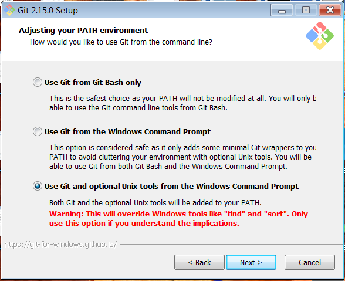
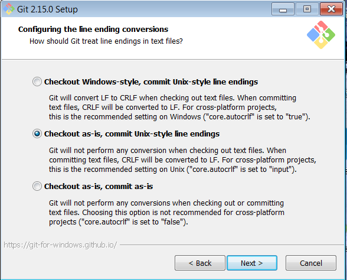
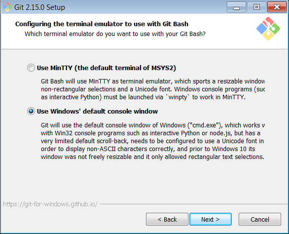
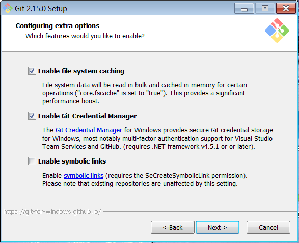
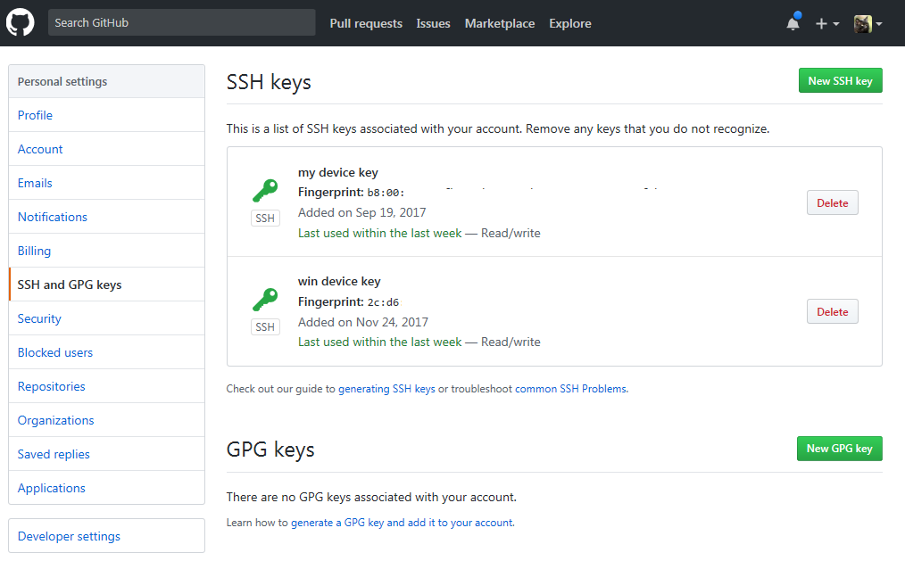
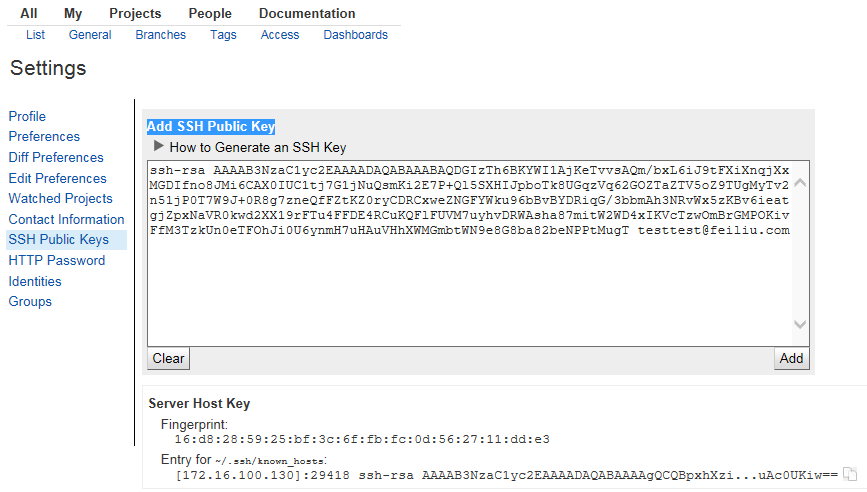
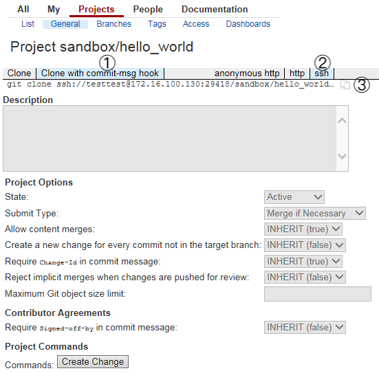

# 玩转 Git BASH
.notes: Generate HTML5 slideshows by landslide

<!-- landslide git_bash.md --relative --copy-theme -d git-bash.html -->

 * V1.0
 * liyan 2017-11-27

## 从前有个工程师，想用 git …

<!-- .qr: 450|http://172.16.100.90:10000/slide/gerrit/git-bash.html -->

---

## 小王的学习路径

Back to [Git 协作开发上手指南](./index.html)

* 在开发机上安装 git 环境： [玩转 Git Bash](./git-bash.html) 本篇文章
* 使用 gerrit 进行协同开发
* 在测试机上同步测试

## 本文内容包括

### 1. 安装 Git for Windows 需要注意的内容
### 2. 如何配置 SSH Public Key 访问外部的git服务器
### 3. 如何配置本地仓库
### 4. 在 Gerrit SandBox 练习 git 基本操作

---

## 关于 Git for Windows

Git for Windows是Git官方提供的Windows版本，包括命令行和图形界面。

[git-for-windows](https://git-for-windows.github.io/)

---

## 1. 安装
*Git for Windows*是官方推荐的windows环境的Git工具集，包括Git GUI和Git Bash两部分。

在安装工程中，有以下一些选项比较重要

---

## 1.1 Adjusting your PATH environment

请选择 Use Git and optional Unix tools
	

---
## 1.2 配置换行符为Unix风格
.notes: Configuring the line ending conversions

请选择 checkout as-is, commit Unix-style line endings
	

---
## 1.3 配置终端模拟器为wondow终端
.notes: Configuring the terminal emulator to use the Git Bash

请选择 Use Windows' default console window
	

---
## 1.4 Configuring extra options

请勾选以下内容

* Enable file system caching
* Enable Git Credential Manager

---
## 2. 配置 SSH Public Key
### 2.1 生成SSH RSA 密钥对

	$ ssh-keygen -q -t rsa -C "testtest@feiliu.com"
	Enter file in which to save the key (/c/Users/liyan/.ssh/id_rsa):
	Enter passphrase (empty for no passphrase):
	Enter same passphrase again:

	liyan@hummer MINGW32 ~/.ssh
	$ ll ~/.ssh/
	total 9
	-rw-r--r-- 1 liyan 197121 1679 Nov 24 17:10 id_rsa
	-rw-r--r-- 1 liyan 197121  401 Nov 24 17:10 id_rsa.pub
	-rw-r--r-- 1 liyan 197121  627 Jun 12  2014 known_hosts

---
## 2.2 获取RSA公钥

	$ cat ~/.ssh/id_rsa.pub
	ssh-rsa AAAAB3NzaC1yc2EAAAADAQABAAABAQDGIzTh6BKYWI1AjKeTvvsAQm/bxL6iJ9tFXiXnqjXx
	MGDIfno8JMi6CAX0IUC1tj7G1jNuQsmKi2E7P+Ql5SXHIJpboTk8UGqzVq62GOZTaZTV5oZ9TUgMyTv2
	n51jP0T7W9J+0R8g7zneQfFZtKZ0ryCDRCxweZNGFYWku96bBvBYDRiqG/3bbmAh3NRvWx5zKBv6ieat
	gjZpxNaVR0kwd2XX19rFTu4FFDE4RCuKQFlFUVM7uyhvDRWAsha87mitW2WD4xIKVcTzwOmBrGMPOKiv
	FfM3TzkUn0eTFOhJi0U6ynmH7uHAuVHhXWMGmbtWN9e8G8ba82beNPPtMugT testtest@feiliu.com

---
## 2.3 把公钥配置到远端服务
### 2.3.1 把公钥配置到github

---
## 2.3.2 把公钥配置到gerrit

---
## 2.4 访问测试
### 2.4.1 访问github账号

	$ ssh -T git@github.com
	Hi twotwo! You've successfully authenticated, but GitHub does not provide shell access.

### 2.4.1 访问gerrit账号

	$ ssh -p29418 -l testtest 172.16.100.130 gerrit version
	gerrit version 2.13.3

---

## 3. 配置本地仓库
有两种方式可以获得一个本地仓库，这里我们从gerrit沙箱中clone一个项目到本地

* 在Gerrit页面上获取clone命名
* 执行成功后设置本地仓库参数
* 本地仓库提交到Gerrit
---

## 3.1 在Gerrit页面上获取clone命名

---

## 3.2 执行成功后设置本地仓库参数

	$ git config user.email
	liyan@feiliu.com

	$ git config user.email testtest@feiliu.com

	$ git config user.email
	testtest@feiliu.com

---

## 3.3 本地仓库提交到Gerrit

	$ git add testtest.md

	$ git commit -m 'my first commit'
	[master c4dfa72] my first commit
	 1 file changed, 1 insertion(+)
	 create mode 100644 testtest.md

	$ git push origin master
	Counting objects: 3, done.
	Delta compression using up to 2 threads.
	Compressing objects: 100% (2/2), done.
	Writing objects: 100% (3/3), 312 bytes | 312.00 KiB/s, done.
	Total 3 (delta 1), reused 0 (delta 0)
	remote: Resolving deltas: 100% (1/1)
	remote: Processing changes: refs: 1, done
	To ssh://172.16.100.130:29418/sandbox/hello_world
	   134e713..c4dfa72  master -> master

	$ git log

	$ gitk #图形界面

---
## 4. git 基本操作 练习

向本地的另外一个目录中再次克隆上面的工程，练习获取远端的更新、解决冲突等操作