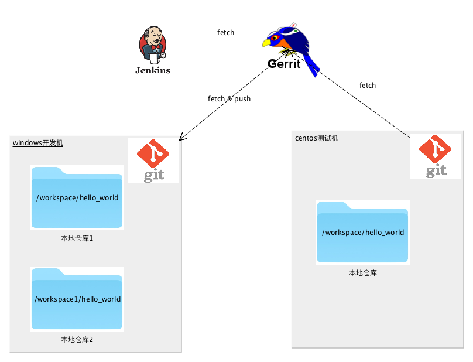

# Git 协作开发上手指南
.notes: Generate HTML5 slideshows by landslide

<!-- landslide index.md --relative --copy-theme -d index.html -->

 * V1.0
 * liyan 2017-11-15

## 从前有个工程师，想用 git …

<!-- .qr: 450|http://172.16.100.90:10000/slide/gerrit/ -->

---

## 小王的工作环境

* 用一台windows开发机；
* 用一台centos测试机；
* 团队用Jenkins做持续集成；
* 团队用gerrit做代码管理；

## 小王的学习路径
* 了解开发环境下这些服务都是怎样工作的 本篇文章
* 学习如何在Windows下[玩转 Git Bash](./git-bash.html) 
* 学习更多 gerrit 进行协同开发的知识 [Gerrit 使用入门](./gerrit.html)
* 练习在开发机与测试机上进行同步的开发测试

---

## 本文主要内容

### 1. 工作环境介绍
### 2. Gerrit与代码评审
### 3. 持续集成的实践
### 4. 总结

---

## 1. 工作环境介绍

Gerrit Overview

---

## 1.1 本地环境一览

---

## 2. Gerrit与代码评审

---

## 3. 持续集成实践

---

## 4. 总结

