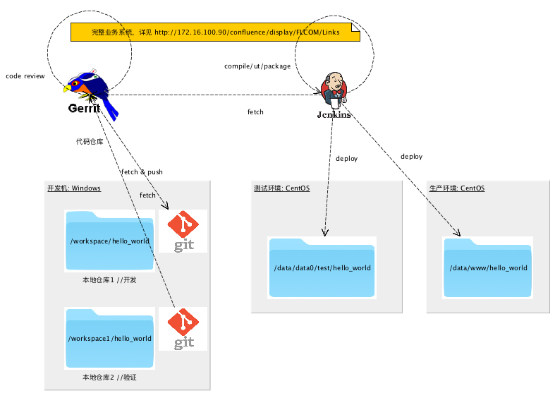

# 软件开发的工作方法
.notes: Generate HTML5 slideshows by landslide

<!-- landslide index.md --relative --copy-theme -d index.html -->

 * V1.0
 * liyan 2017-11-15

## 从前，有一枚野生的程序猿，加入了一支攻城狮团队 …

<!-- .qr: 450|http://172.16.100.90:10000/slide/gerrit/ -->

---

## 怎样快速成为一只合格的攻城狮呢？
.notes: 要摆脱野生状态，小白需要掌握必要的工作方法

* 软件开发的工作方法 //本篇文章
	- 持续集成
	- 代码评审
	- 工作日志
* 学习如何在Windows下[使用 Git Bash](./git-bash.html) 
* 学习更多 gerrit 进行协作开发的知识 [Gerrit 使用入门](./gerrit.html)
* 更多的学习与练习
	- 工作日志与例会
	- JIRA、WIKI的使用
	- 正式项目第一步： 搭建测试环境

---

## 本文主要内容

### 1. 持续集成简介
### 2. 环境与流程
### 3. Gerrit与代码评审
### 4. 总结

---

## 1. 持续集成简介

* WHAT
	- CI 是一种软件工程流程。最早是指频繁地（一天多次）把所有工程师的协作工作结果集成到共用主线（mainline）上
	- CI 会搭配自动单元测试，能使缺陷更容易被发现和改正
	- 现代CI服务器处理UT，往往还会包括持续交付和持续部署
* WHY
	- 快速发现错误
	- 降低集成成本
	- 提高可靠性
* HOW
	- 提交
	- 构建： 编译&测试&打包
	- 部署

---

## 2. 环境与流程

2.1 支持持续集成的开发环境

* 开发机： 攻城狮的生产工具，一般都还是安装的Windows系统
* 测试服务器： 若干安装CentOS的服务器，用来测试服务，团队范围内公用
* 生产服务器： 也叫业务服务器，操作要谨慎！
* Jenkins： 团队的CI服务器，用来支持持续集成流程；
* Gerrit： 团队代码仓库和代码评审平台；

---

## 2.2 开发流程： 从开发到发布

---

## 2. Gerrit与代码评审

* Gerrit Web 控制台
* 代码评审

---

## 2.1 Gerrit Web 控制台

### 登录 Web 控制台
[Gerrit Web Console](http://172.16.100.130/gerrit/) 已经集成了账号管理系统，大家可以使用自己的jira账号直接登录(Sign In)

点击Gerrit 页面右上角“Sign In”链接后，出现如下登录界面

---

## 3. 持续集成实践

示例

---

## 4. 总结

参考内容

* [Continuous Integration](http://wiki.li3huo.com/Continuous_Integration) 
* [Continuous Integration and deployment with Jenkins and Node.js](https://codeforgeek.com/2016/04/continuous-integration-deployment-jenkins-node-js/)

