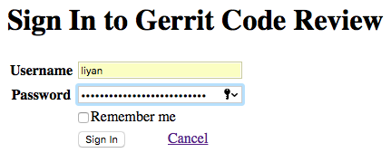
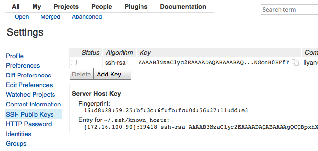
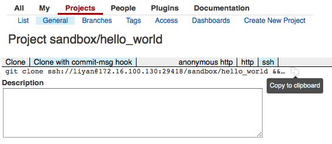
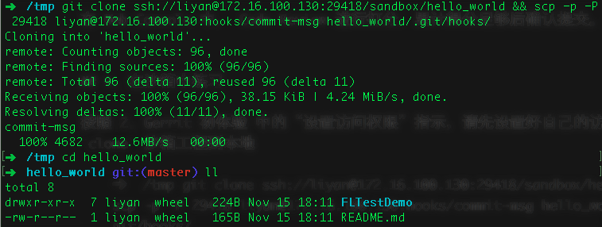
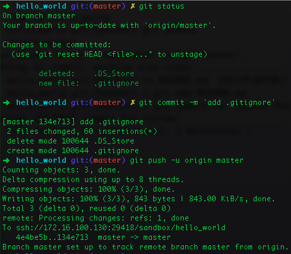

# Gerrit 使用入门
.notes: Generate HTML5 slideshows by landslide

 * V1.0
 * liyan 2017-11-15

## 1. Gerrit 是什么
## 2. Gerrit 怎么用

<!-- .qr: 450|http://172.16.100.90:10000/slide/gerrit/ -->

---

## 1. Gerrit 简介

Gerrit 是一个用 Java 写的开源软件：

 * 首先，Gerrit 提供了具备访问控制的 Git 版本管理服务；
 * 然后，Gerrit 又在 Git 基础上提供了web方式的代码评审功能；
 * 最有趣的一点，这个代码评审功能是可选的，团队可以决定一个项目是否需要加入评审逻辑

---

## 1. Gerrit 简介

.notes: CI Builder, we use Jenkins / Reviewer, review process is optional

---

## 2. Gerrit 初体验

使用 Gerrit 的最简步骤

 * 设置访问权限
 * Submit a Change

---

## 2.1 设置访问权限

如果需要对代码进行修改或者对代码进行评审，就必须到 Web 控制台上进行设置

### 登录 Web 控制台
[Gerrit Web Console](http://172.16.100.130/gerrit/) 已经集成了账号管理系统，大家可以使用自己的jira账号直接登录(Sign In)

点击Gerrit 页面右上角“Sign In”链接后，出现如下登录界面

---

## 配置 SSH(HTTP) 访问认证

进入[Settings](http://172.16.100.130/gerrit/#/settings/)界面

### SSH Public Keys

点"Add Key ..."按钮，把本机ssh密钥对中的公钥填入对话框。 

☞ 进一步阅读： [Use Public Key Authentication with SSH](https://www.linode.com/docs/security/use-public-key-authentication-with-ssh)

---

## 用命令行直接访问 Gerrit

完成以上配置后，我们就可以与 Gerrit 进行对话了

	➜  learn-git git:(master) ✗ ssh -p29418 liyan@172.16.100.90

	  ****    Welcome to Gerrit Code Review    ****

	  Hi liyan, you have successfully connected over SSH.

	  Unfortunately, interactive shells are disabled.
	  To clone a hosted Git repository, use:

	  git clone ssh://liyan@172.16.100.90:29418/REPOSITORY_NAME.git

	Connection to 172.16.100.90 closed.

---

### HTTP Password

On Gerrit installations that do not support SSH authentication, the user must authenticate via HTTP/HTTPS.

参考[链接](https://gerrit-documentation.storage.googleapis.com/Documentation/2.13.3/user-upload.html#http)

设置之后，用户可以通过HTTP协议访问仓库

	git clone http://it.feiliu.com/gerrit/a/sandbox/hello_world

HTTP Digest Authentication Removed at 2.14

---

## 执行一下 `gerrit` 命令

配置好 `SSH Public Keys` 之后，我们就可以使用 Gerrit 提供的服务了

	ssh -p29418 172.16.100.90 gerrit

可以看到这个命令的使用提示信息。为了减少输入，我设置了一个别名

	alias gerrit="ssh -p29418 172.16.100.90 gerrit"

---

## 2.2 Submit a Change

接下来咱们在沙箱工程中提交一个变更

使用 Gerrit 和 使用其它 Git 服务基本一样，其中存在的细微差别我会着重强调

### 拷贝 clone 命令

在 Web Console 中 拷贝 clone 命令，注意 必须选择`Clone with commit-msg hook`方式！

	➜  /tmp git clone ssh://liyan@172.16.100.130:29418/sandbox/hello_world && scp -p -P 29418 liyan@172.16.100.130:hooks/commit-msg hello_world/.git/hooks/

---

## 2.2 Submit a Change
### 执行 clone 命令

☞ 进一步阅读： Gerrit 在实现 Git 服务的基础上，添加了代码 review 的功能，因此在clone命令之后，还从服务器上又拷贝了一个 `commit-msg` 的钩子工具。

---

## 2.2 Submit a Change

### 提交本地 && 推送到 Gerrit

---

## 3. Gerrit 进阶： Submit changes for review

☞ 检查 Change-Id ， 这个增加的Change-Id字段是实现 Gerrit 代码评审功能所必须的。如果没有加入commit-msg钩子或不具备执行权限，将不生成此字段。这样commit的代码只能直接提交到主干，无法进行review

	➜  hello_world git:(master) git log
	commit 72f756d6c5ee1a37ab965a18dc20a071ef8535b9
	Author: twotwo <twotwo.li@gmail.com>
	Date:   Wed Feb 15 16:58:54 2017 +0800

	    commit for review
	    
	    Change-Id: I648d97f05ef616d10e426d1ac6cff9ace07f39a8

	commit 12a550cf75e5b1347cf750ba35b440c9c9d049f8
	Author: twotwo <twotwo.li@gmail.com>
	Date:   Tue Dec 13 18:30:00 2016 +0800

	    add README.md
	    
	    Change-Id: I55be6e211eaf80a72a5e6c363745a9a43c64d362
	(END)

---
提交 Review

	➜  hello_world git:(master) git push -u origin HEAD:refs/for/master
	Counting objects: 3, done.
	Delta compression using up to 8 threads.
	Compressing objects: 100% (2/2), done.
	Writing objects: 100% (3/3), 613 bytes | 0 bytes/s, done.
	Total 3 (delta 0), reused 0 (delta 0)
	remote: Processing changes: new: 1, refs: 1, done    
	remote: 
	remote: New Changes:
	remote:   http://172.16.100.90/gerrit/2 commit for review
	remote: 
	To ssh://172.16.100.90:29418/sandbox/hello_world
	 * [new branch]      HEAD -> refs/for/master

---

## 4. 在 Web Console 中进行代码评审

### Verify Changes

在 Web Console 的 [My Reviews](http://172.16.100.90/gerrit/#/dashboard/self) 的 Outgoing reviews 中，出现了这条提交信息

Review 这个版本与上个版本直接的不同

### Submit the Change

在 Web Console 中， Code Review 进行打分，累计得分足够后确认提交。

---

## 5. 学习效果自我评估

按照 2. Gerrit 初体验 中的“设置访问权限”指示，请先设置好自己的访问权限，然后 `clone` 沙箱工程到本地

	➜  /tmp git clone ssh://liyan@172.16.100.130:29418/sandbox/hello_world && scp -p -P 29418 liyan@172.16.100.130:hooks/commit-msg hello_world/.git/hooks/

⚠️请在这个项目里进行练习！
